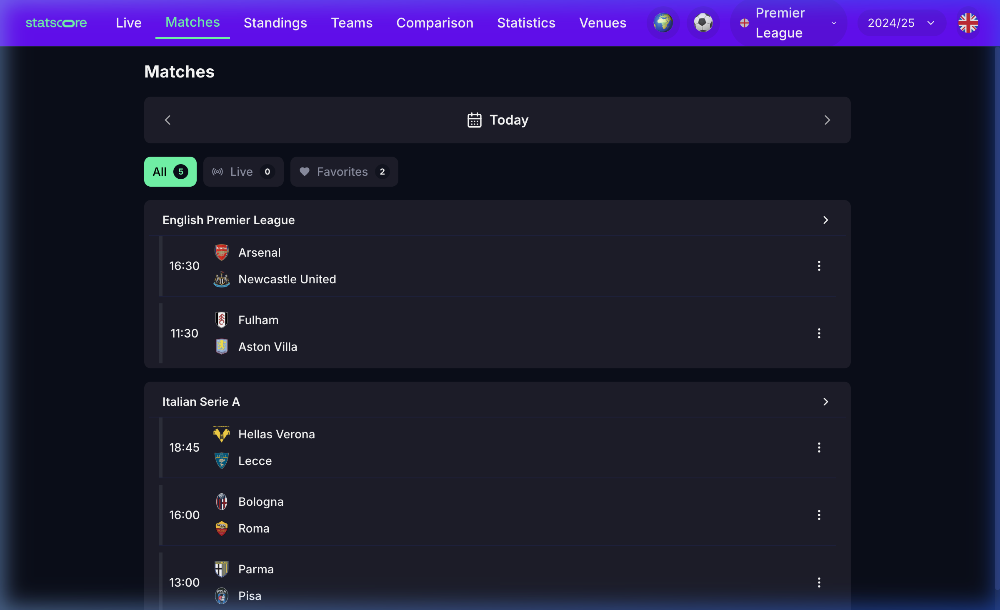
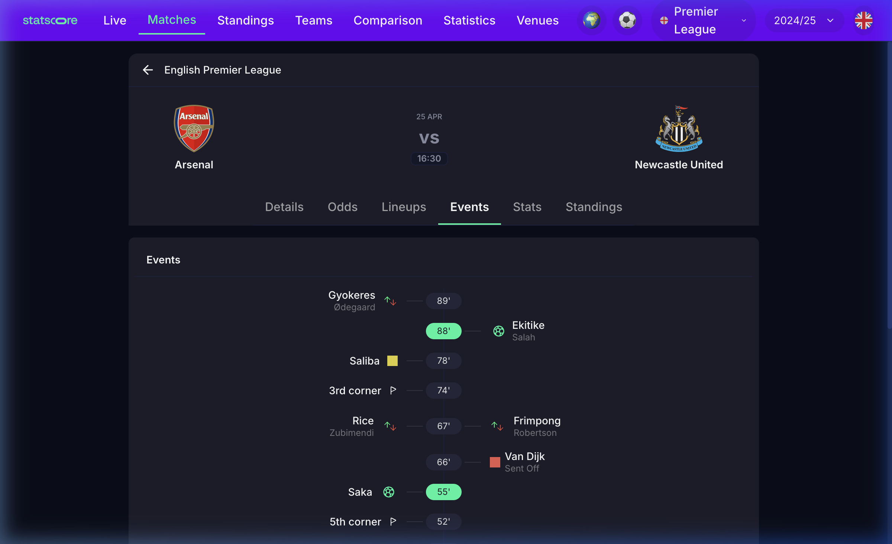
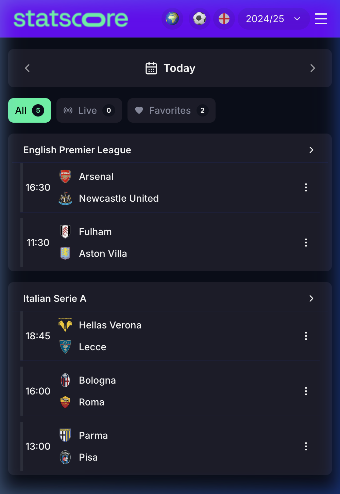
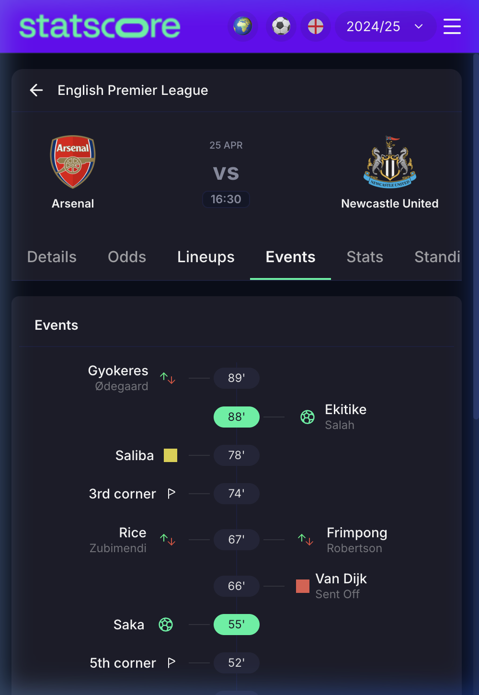

# ⚽ StatScore Dashboard

> **Senior Frontend Developer Test Project**
>
> A high-performance, pixel-perfect sports dashboard built with **React 19**, **TypeScript**, and **Tailwind CSS 4**. This application delivers real-time scores, live match fixtures, and detailed event timelines by integrating with **TheSportsDB** API.

---

## 📱 Visual Overview

### Desktop Experience
Enjoy a wide-screen, data-rich dashboard with sidebars for navigation and expanded views for match details.


*Main Dashboard - High-level overview of live and upcoming matches.*


*Match Details - Detailed event timeline with goals, cards, and substitutions.*

### Mobile Experience
Fully responsive and optimized for mobile devices, featuring a slide-out drawer and touch-friendly interaction patterns.

<p align="center">
  
  
</p>

---

## 🚀 Key Features

-   **Live Score Updates**: Real-time polling (20s interval) ensures scores are always up-to-date without page refreshes.
-   **Intelligent Match Filtering**: Filter matches by 'All', 'Live', or 'Favorites' with dynamic count indicators.
-   **Comprehensive Match Details**: Dive deep into matches with a vertical event timeline showing goals ⚽, cards 🟨🟥, substitutions 🔄, and more.
-   **Interactive Date Navigation**: Browse past and future fixtures with a custom-built, responsive date picker.
-   **Pixel-Perfect Design**: Meticulously crafted UI following modern design principles, dark mode by default, and smooth transitions.
-   **Responsive Layout**: Seamlessly transitions between desktop sidebar and mobile bottom/drawer navigation.

---

## 🛠 Technical Implementation

### Core Tech Stack
| Technology | Role |
| :--- | :--- |
| **React 19** | UI Library with latest Concurrent Mode features |
| **TypeScript** | Type-safe development with strict configuration |
| **Tailwind CSS 4** | Next-gen styling with zero-runtime overhead |
| **Vite 7** | Ultra-fast build tool and development server |
| **React Router v7** | Declarative routing for deep-linking matches |
| **TanStack Query** | Efficient server-state management and caching |

### Architecture Highlights
-   **Custom Hooks for Business Logic**: All data fetching and polling logic is encapsulated in custom hooks (`useFixtures`, `useMatchDetails`, `usePolling`), keeping components clean and focused on presentation.
-   **Polling Strategy**: Implemented a robust polling mechanism using `usePolling` that handles component unmounting and prevents stale closures.
-   **Event Timeline Engine**: A sophisticated utility transforms flat API responses into a structured, dual-sided timeline, grouping events by minute and team.
-   **Design System**: Built a consistent UI primitive layer (`Badge`, `Skeleton`, `TeamBadge`) to ensure visual consistency across the entire app.

---

## 📁 Project Structure

```text
src/
├── components/
│   ├── fixtures/       # Dashboard & Match list components
│   ├── layout/         # Shell, Sidebar, and Header
│   ├── match/          # Detail-specific components (Timeline, Header)
│   └── ui/             # Reusable atomic UI components
├── hooks/              # Custom React hooks (Data fetching, Polling)
├── lib/                # API wrappers, Types, and Utils
├── pages/              # Main route entries (Dashboard, Details)
└── index.css           # Tailwind 4 configuration & custom animations
```

---

## ⚙️ Getting Started

### Prerequisites
-   **Node.js** (v18 or higher)
-   **npm** or **pnpm**

### Installation

1.  **Clone the repository**
    ```bash
    git clone https://github.com/zedatgithub12/expertly-home-take-assessment.git
    cd statScore-frontend
    ```

2.  **Install dependencies**
    ```bash
    npm install
    ```

3.  **Environment Setup**
    Create a `.env` file in the root directory:
    ```env
    VITE_API_BASE_URL=https://www.thesportsdb.com/api/v1/json/123
    ```

4.  **Start the development server**
    ```bash
    npm run dev
    ```
    The app will be available at `http://localhost:5173`.

---

## 📝 Assessment Summary
This project was built as a demonstration of senior-level frontend engineering skills for a technical test, focusing on:
-   **Performance**: Minimal re-renders and optimized asset delivery.
-   **Code Quality**: Clean, documented, and type-safe codebase.
-   **UX/UI**: High-fidelity implementation of professional designs.
-   **Robustness**: Graceful handling of loading, error, and empty states.

---

Developed with ❤️ by **Bekalu sisay Iticha**
